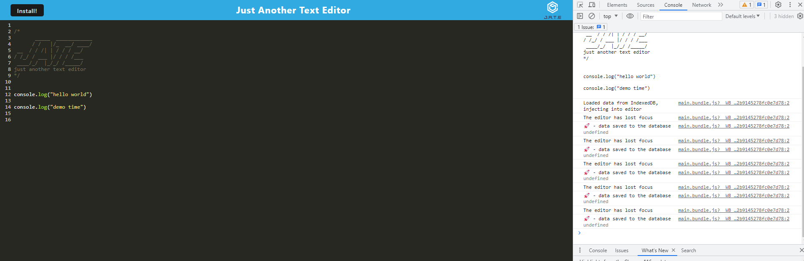
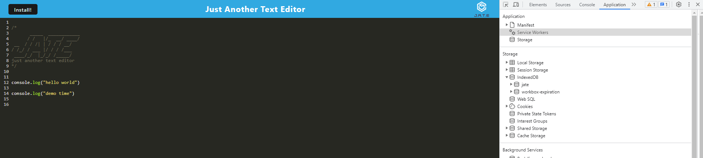
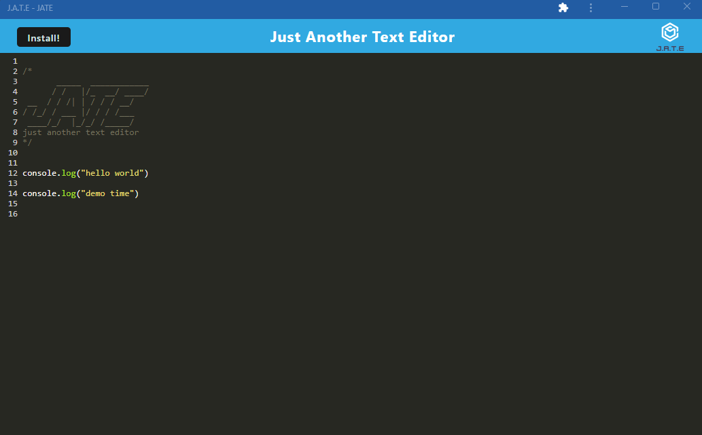

# Text Editor

## Summary
This is a text editor that runs in the browser. The app is a single-page application that meets the PWA criteria. Additionally, it will feature a number of data persistence techniques that serve as redundancy in case one of the options is not supported by the browser. The application will also function offline. Given starter code, the goal of this project was for me to properly setup and configure the web app so that it could function as a PWA. 

When you open the app on my Heroku link (below), you will see a text editor. This text editor includes a Manifest, Service Workers and IndexedDB. You can hit the install button and use this app from your desktop. When you do so, you will see that what you added in the desktop will updated on the web browser, and vice versa.

## Screenshots

## Author
Michael Engstrand

## Heroku Link
https://text-editor-engstrand-2b9500f8b90e.herokuapp.com/

## Github Link
https://github.com/mikeengstrand/